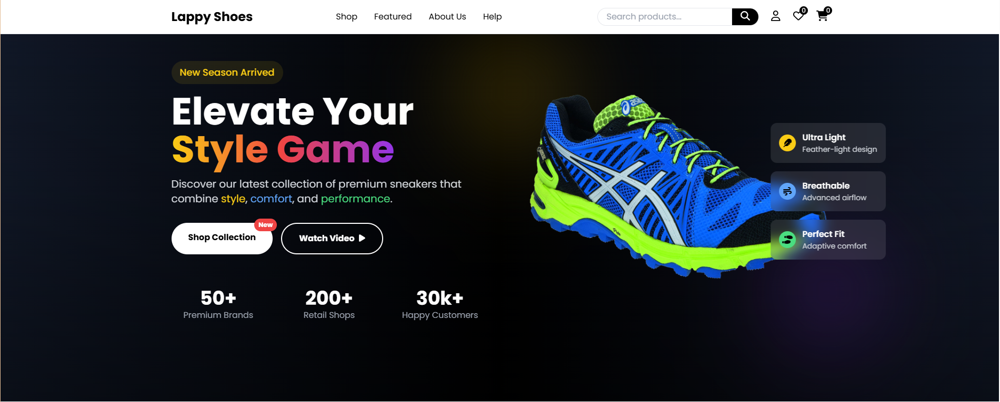
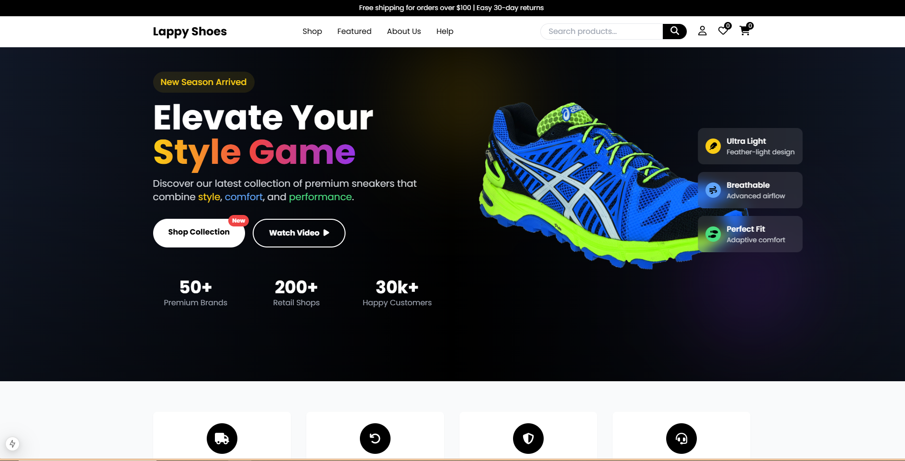
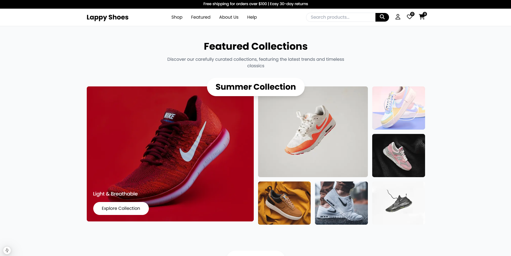
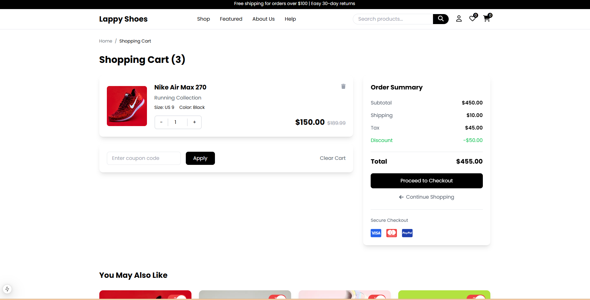
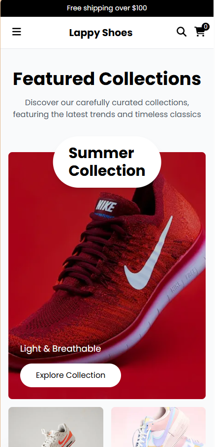

# 👟 Lappy Shoes - Premium Shoe Store

  

Lappy Shoes là một website thương mại điện tử hiện đại được xây dựng bằng Next.js 13+, TypeScript và Tailwind CSS. Website cung cấp trải nghiệm mua sắm giày dép trực tuyến mượt mà và thân thiện với người dùng.

## 📸 Screenshots

  
  

  
  

## ✨ Tính năng

- 🎨 Giao diện người dùng hiện đại và responsive
- 🛍️ Hiển thị sản phẩm với bộ lọc và tìm kiếm
- 🛒 Giỏ hàng và thanh toán
- 👤 Xác thực và quản lý tài khoản người dùng
- ❤️ Danh sách yêu thích
- 🏷️ Quản lý danh mục sản phẩm
- 🌟 Bộ sưu tập nổi bật
- 📱 Tối ưu hóa cho thiết bị di động

## 🎯 Demo

  

Xem demo trực tiếp tại: [Lappy Shoes Demo](https://lappy-shoes.vercel.app)

## 🚀 Tech Stack

- [Next.js 13+](https://nextjs.org/) - Framework React
- [TypeScript](https://www.typescriptlang.org/) - Ngôn ngữ lập trình
- [Tailwind CSS](https://tailwindcss.com/) - Framework CSS
- [Font Awesome](https://fontawesome.com/) - Icon library

## 📱 Responsive Design

  

## 📦 Cài đặt

1. Clone repository:
\`\`\`bash
git clone https://github.com/your-username/lappy-shoes.git
\`\`\`

2. Di chuyển vào thư mục dự án:
\`\`\`bash
cd lappy-shoes
\`\`\`

3. Cài đặt dependencies:
\`\`\`bash
npm install
# hoặc
yarn install
\`\`\`

4. Tạo file môi trường:
\`\`\`bash
cp .env.example .env.local
\`\`\`

5. Khởi động development server:
\`\`\`bash
npm run dev
# hoặc
yarn dev
\`\`\`

## 🌐 Môi trường

Tạo file \`.env.local\` trong thư mục gốc và thêm các biến môi trường sau:

\`\`\`env
# App
NEXT_PUBLIC_APP_URL=http://localhost:3000
NEXT_PUBLIC_APP_NAME="Lappy Shoes"

# API URLs
NEXT_PUBLIC_API_URL=http://localhost:3000/api
\`\`\`

## 📁 Cấu trúc thư mục

\`\`\`
src/
├── app/                # App router pages
├── components/         # React components
│   ├── home/          # Homepage components
│   ├── layout/        # Layout components
│   ├── shop/          # Shop components
│   └── common/        # Common components
├── styles/            # Global styles
└── types/             # TypeScript types
\`\`\`

## 🔨 Scripts

- \`npm run dev\` - Khởi động development server
- \`npm run build\` - Build dự án cho production
- \`npm run start\` - Khởi động production server
- \`npm run lint\` - Kiểm tra lỗi với ESLint

## 🤝 Đóng góp

Mọi đóng góp đều được chào đón! Vui lòng:

1. Fork dự án
2. Tạo branch tính năng (\`git checkout -b feature/amazing-feature\`)
3. Commit thay đổi (\`git commit -m 'Add some amazing feature'\`)
4. Push lên branch (\`git push origin feature/amazing-feature\`)
5. Mở Pull Request

## 📝 License

Dự án này được cấp phép theo giấy phép MIT - xem file [LICENSE](LICENSE) để biết thêm chi tiết.

## 👨‍💻 Tác giả

- **Nguyên Kỷ** - [Website](https://lappyhacking.onrender.com/)

## 🙏 Cảm ơn

- [Next.js](https://nextjs.org/)
- [Tailwind CSS](https://tailwindcss.com/)
- [Font Awesome](https://fontawesome.com/)
- [Vercel](https://vercel.com/)
